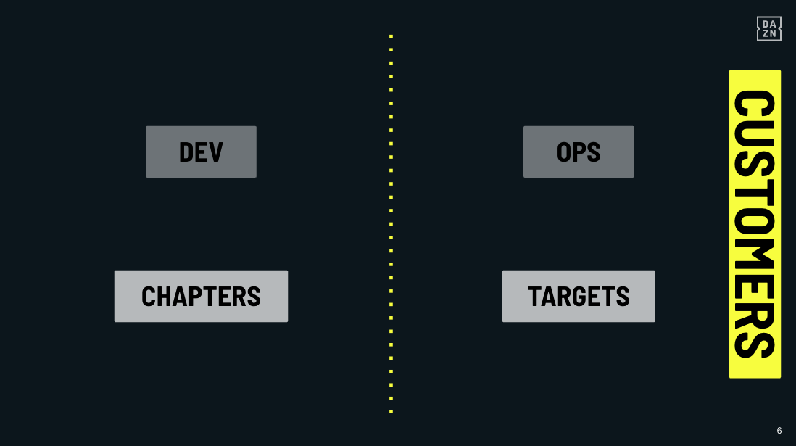

#[fit] DevOps for Frontend
###[fit] _**Beyond Desktop Browsers**_

@_maxgallo

---

[.column]
# [fit] Hi,

[.column]
 
# [fit] I'm Max Gallo
##[fit] _**Italy > London**_
##[fit] _**Principal Engineer at DAZN**_
##[fit]@_maxgallo

---

# Our Journey

- Beyond Desktop Browsers
- To DevOps or not To DevOps
- DevOps for Frontend

---

# [fit] Beyond
# [fit] Desktop
# [fit] Browsers

---

# DAZN

[.column]

### Live Sport ⚽️ 🏀 🏎

[.column]

### Streaming📱 📺 🕹

---

[.column]
###[fit] 25+
###[fit] _**HTML-based**_
###[fit] devices supported

[.column]

- Browser Engine
- Developer Experience
- Remote
- Video Players
- ...much more

---

# Teams Structure

^ Ownership

---

# _**Challenge #1**_

## Slow feedback loop

---

# _**Challenge #2**_

## Work Visibility

^ When is this feature going to be ready ?

---

# _**Challenge #3**_

## Devices Teams can't fix issues properly

---

# [fit] To DevOps
# [fit] or not
# [fit] to DevOps

<!--

this was possible because of abstractions (servers)
- AWS or a "Platform" team that leveraged some of the operation tasks to allow a dev team to become more ops

If we create an abstractions on the devices differencies we can allow feature team to deploy their feature in production
-->

---

“The First Way emphasizes the performance of the entire system, as opposed to the performance of a specific silo of work or department.”

*Gene Kim, The DevOps HandBook*

<!-- view of the entire system -->

---

# From Code to Customers #1

@TODO instert image here

---

# From Code to Customers #2

@TODO instert image here

Same image but with feature teams & devices teams

---

# From Code to Customers #3

@TODO instert image here

Same image but with dev & ops

<!--
- EUREKA! -> I've already seen this one, it's DevOps
- DevOps: Development & Operations teams were indipendent squads, each own with its own goal
Official Definition: "a software engineering culture and practice, that aims at unifying software development and software operation."
-->

---

# The Power of Abstraction

DevOps was born because of abstractions

Call it AWS, GCP, Azure, or simply a Platform team that build tools for teams to be autonomous from dev to ops.

<!--
this was possible because of abstractions (servers)
- AWS or a "Platform" team that leveraged some of the operation tasks to allow a dev team to become more ops

If we create an abstractions on the devices differencies we can allow feature team to deploy their feature in production
-->

[.footer: Alex Martelli, The Tower of Abstraction]

---

To apply the devops concept, what's the right abstractions that we need ?

---

# [fit] DevOps
# [fit] for
# [fit] Frontend

---

# One team, two abstractions

Ease the differencies between devices

---

# Abstraction #1
# _**Runtime - Bootstrap**_

- Remotes & Controllers
- Device APIs
- Networking
- Background/Foreground

[.column]

---

# Abstraction #2
# _**Buildtime - Tools**_

- Develop on device
- Debugging on device
- Monitoring
- Test Automation on device (TV Lab)

---

# TV Platform team & Feature teams

Updated image laptop -> customers

---

# Maximise the flow - Lead Time

- Make work visible: single team Jira board
- Reduce batch size: up to the feature teams
- Prevent defect being passed downstream: developing on devices, automation for testing
- always optimise for the global goals: YEY

---

# Takeaways

- DevOps is about unifying and enabling
- The Backend it's just the beginning
- Measure
- Improve
- Repeat

---

#[fit] Thank you

github.com/maxgallo/talk-devops-for-frontend

_@\_maxgallo_

