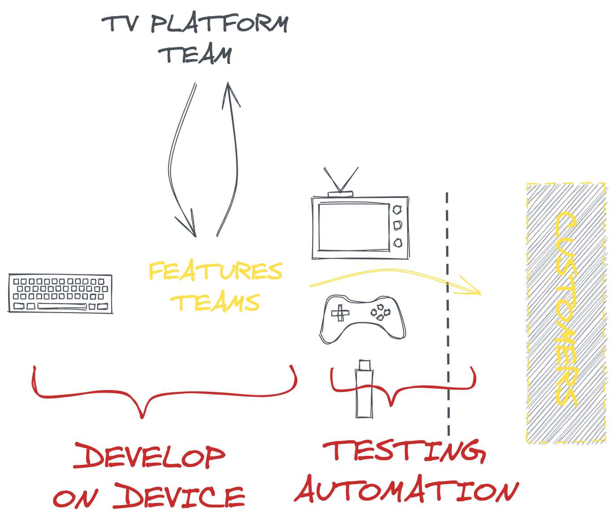

build-lists: true

#[fit] DevOps for Frontend
###[fit] _**Beyond Desktop Browsers**_

@_maxgallo

---

[.column]
# [fit] Hi,

[.column]
 
# [fit] I'm Max[^1] Gallo
##[fit] _**Italy > London**_
##[fit] _**Principal Engineer at DAZN**_
##[fit]@_maxgallo

[^1]: or Massimiliano if you like Italian spelling challenges

---

# Our Journey

- Beyond Desktop Browsers
- To DevOps or not To DevOps
- DevOps for Frontend

---

# [fit] Beyond
# [fit] Desktop
# [fit] Browsers

---

#[fit] DAZN
##[fit] _**Live Sport Streaming**_

---

[.column]
#[fit] 25+
##[fit] _**HTML-based**_
##[fit] devices supported

[.column]

- TVs
- Gaming Console
- Set-top boxes
- ...more

---

# Workflow

^ Ownership

---

# _**Challenge #1**_

## Slow feedback loop

---

# _**Challenge #2**_

## Work Visibility

^ When is this feature going to be released?

---

# _**Challenge #3**_

## Devices Teams can't fix issues properly

---

[.column]
#[fit] Challenges
#[fit] _**Recap**_

[.column]

- Slow Feedback Loop
- Work Visibility
- Device Teams Ownership

---

# [fit] To DevOps
# [fit] or not
# [fit] to DevOps

<!--

this was possible because of abstractions (servers)
- AWS or a "Platform" team that leveraged some of the operation tasks to allow a dev team to become more ops

If we create an abstractions on the devices differencies we can allow feature team to deploy their feature in production
-->

---
 
 
 
“The First Way emphasizes the performance of the entire system, as opposed to the performance of a specific silo of work or department.”

*Gene Kim, The DevOps HandBook*

<!-- view of the entire system -->

---

# From Code to Customers

---

# We've been here before

<!--
- EUREKA! -> I've already seen this one, it's DevOps
- DevOps: Development & Operations teams were indipendent squads, each own with its own goal
Official Definition: "a software engineering culture and practice, that aims at unifying software development and software operation."
-->

---

#[fit] How did we arrive to
#[fit] today's DevOps?

---

# The Power of Abstraction

DevOps is here because of abstractions. Call them *Cloud Providers* like AWS[^a] or GCP[^b], call them *Tools* like Chef, Puppet, Ansible or Terraform, but without them, would we have this conference?

[^a]: Amazon Web Services

[^b]: Google Cloud Platform

---

# Which abstractions do we need?

To apply the DevOps principles, what's the *right* abstractions that we need ?

[.footer: Alex Martelli, [The Tower of Abstractioni (talk)](https://www.youtube.com/watch?v=zhpWhkW8kcc)]

^ "There are only two hard things in Computer Science: cache invalidation and naming things. Phil Karlton"

---

# [fit] DevOps
# [fit] for
# [fit] Frontend

---

# _**The Pain Points**_

#[fit] Devices Differencies

 

---

# _**TV Platform Team**_
# Ease devices differencies

Enable Feature Teams to dev & deploy autonomously

 

---

## _**Abstraction #1**_
# Buildtime - Tools

- Develop on device
- Debugging on device
- Monitoring
- Test Automation on device (TV Lab)

---

## _**Abstraction #2**_
# Runtime

- Remotes & Controllers
- Device APIs
- Networking
- Background/Foreground

[.column]

---

# TV Platform team _**&**_ Features teams

^ TV Platform team enables the Features Team to work on Devices

---

# [fit] Maximise the flow
## _**Make work visible**_

---

# [fit] Maximise the flow
## _**Reduce batch size**_

---

# [fit] Maximise the flow
## _**Prevent Defects being passed downstream**_

---

[.column]
# [fit] Maximise the flow
# [fit] _**Recap**_

[.column]

- One Jira board to make the work visible
- One Team that deploys often, autonomously
- Develop on device early + Test Automation

---

# Takeaways

- The Developer Experience is important
- DevOps is about unifying and enabling
- The Backend it's just the beginning
- Measure, Improve & Repeat

---

#[fit] Thank you

github.com/maxgallo/talk-devops-for-frontend

_@\_maxgallo / @dazneng_

 
 

→ we're hiring (DMs are open)

